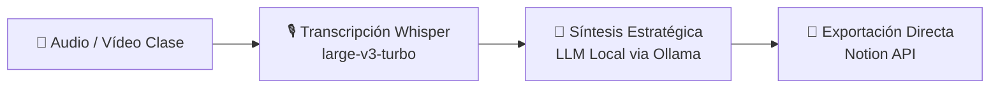

# 🎓 LectureFlow

> **Transforma grabaciones de clases y vídeos largos en apuntes técnicos estructurados en Notion — 100% local, privado y sin terminal.**

[](https://python.org)
[]()
[]()
[-green.svg)]()
[]()
[](https://opensource.org/licenses/MIT)

---

## 📖 Descripción del Proyecto

**LectureFlow** es un pipeline local *"Zero-Terminal"* diseñado para automatizar la transformación de grabaciones de clases y vídeos de larga duración en apuntes técnicos estructurados, enriquecidos y listos para estudiar en **Notion**.

### 💡 El Problema que Resuelve
Tomar apuntes a mano durante clases u horas de contenido denso requiere una atención constante que dificulta la comprensión en tiempo real. Por otro lado, delegar este trabajo en servicios SaaS o APIs de pago en la nube genera costes recurrentes elevados y plantea problemas sobre la privacidad de tus datos. **LectureFlow elimina ambos obstáculos:** procesa grabaciones de cualquier duración en tu propio ordenador, de forma gratuita, ilimitada y 100% confidencial.

### 🔄 Flujo de Trabajo

1. **Transcripción**: Extracción de audio PCM (FFmpeg) y transcripción de alta precisión con **Whisper** (`large-v3-turbo`).
2. **Síntesis Estratégica**: Generación de apuntes técnicos organizados, glosarios y resúmenes mediante un **LLM local** (*Ollama / Qwen 2.5*).
3. **Exportación a Notion**: Envío automático de los apuntes formateados con bloques interactivos a tu base de datos de Notion.

### ⭐ Diferenciales Clave
- 🔒 **Privacidad Total**: Proceso 100% local. Tu audio, transcripciones y apuntes jamás salen de tu máquina hacia servidores de terceros.
- ⚡ **Aceleración Nativa Dual**: Soporte optimizado tanto para hardware Apple Silicon (**Metal** vía `mlx-whisper`) en macOS como GPUs NVIDIA (**CUDA**) en Windows.
- ⏱️ **Marcas de Tiempo Interactivas**: Timestamps sincronizados en los apuntes para auditar o repasar momentos específicos del vídeo original al instante.
- 🚀 **Zero-Terminal**: Lanzadores ejecutables para macOS y Windows que permiten usar la herramienta sin interactuar con la consola de comandos en el día a día.

---

## 📌 Requisitos Previos

Antes de ejecutar la instalación rápida, asegúrate de tener instalado en tu sistema:

1. **Python 3.10+**: [python.org](https://www.python.org/downloads/) *(En Windows, recuerda marcar "Add Python to PATH")*.
2. **FFmpeg**: Necesario para la extracción de audio PCM de archivos multimedia. *(El script de instalación intentará instalarlo automáticamente mediante `winget` en Windows o `brew` en macOS)*.
3. **Ollama**: Descárgalo de [ollama.com](https://ollama.com) y descarga el modelo Qwen 2.5 ejecutando en tu consola:
   ```bash
   ollama run qwen2.5:7b
   ```
   *(También compatible con `ollama run qwen2.5:latest`)*.

---

## 🚀 Instalación Rápida (Zero Terminal)

LectureFlow está diseñado para ser clonado y ejecutado **sin necesidad de interactuar con la terminal** en el uso diario.

### 🪟 Windows (NVIDIA CUDA / CPU)

1. **Configuración Inicial (Solo la primera vez):**
   * Haz doble clic en el archivo `scripts/setup_windows.bat`.
   * El script creará automáticamente el entorno virtual `venv_win`, instalará las dependencias (incluyendo librerías de aceleración CUDA de NVIDIA `cublas` y `cudnn`) y verificará FFmpeg.
2. **Ejecución Diaria:**
   * Haz doble clic en `Iniciar_Windows.vbs` (arranca el asistente en segundo plano y abre la interfaz web en tu navegador).

### 🍎 macOS (Apple Silicon / Metal)

1. **Configuración Inicial (Solo la primera vez):**
   * Haz doble clic en `scripts/setup_mac.command` (o ejecuta `bash scripts/setup_mac.sh`).
   * El script creará el entorno `venv`, instalará `mlx-whisper` optimizado para GPU Metal (M1/M2/M3/M4) y verificará FFmpeg vía Homebrew.
2. **Ejecución Diaria:**
   * Haz doble clic en `Iniciar_Mac.command`.

---

## 🔑 Configuración de Notion API

1. Crea una integración interna en [Notion Integrations](https://www.notion.so/my-integrations).
2. Copia el **Internal Integration Secret**.
3. En la base de datos de Notion donde deseas guardar los apuntes, haz clic en los 3 puntos `...` (arriba a la derecha) > **Conectar a** > selecciona tu integración.
4. Crea un archivo `.env` en la raíz del proyecto a partir de `.env.example`:
   ```env
   NOTION_TOKEN=tu_token_de_notion
   NOTION_DATABASE_ID=tu_id_de_base_de_datos
   ```

---

## ✨ Características Clave

- **100% Privado y Local**: Sin APIs de pago en la nube. Todo el procesamiento de audio y generación de apuntes se realiza localmente.
- **Soporte para Clases Largas (> 1.5 horas)**: Motor streaming en tiempo real y timeout elevado a 4 horas (14.400s).
- **Control de Alucinaciones (Critic-Loop)**: Verificación automática de fidelidad con reporte de auditoría.
- **Aceleración Hardware Nativa**:
  - macOS: `mlx-whisper` con `large-v3-turbo` sobre GPU Metal M1/M2/M3/M4.
  - Windows: `faster-whisper` con `large-v3-turbo` sobre NVIDIA CUDA (`float16`) y fallback automático a CPU (`int8`).

---

## 🛠️ Arquitectura y Tecnologías

- **UI Framework:** Streamlit
- **Motor de Transcripción:** Faster-Whisper (CUDA/CPU) / MLX-Whisper (Metal)
- **Motor LLM Local:** Ollama (Qwen 2.5 7B)
- **Exportador:** Notion API v1 (batch chunking de 100 bloques)
- **Audio Pipeline:** FFmpeg PCM WAV 16kHz
