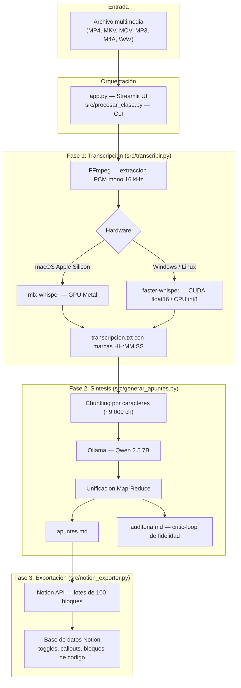

# LectureFlow

Pipeline local sin terminal para transcribir grabaciones de clase, generar apuntes estructurados mediante un LLM local y exportarlos a Notion. El procesamiento se ejecuta íntegramente en el equipo del usuario usando Whisper `large-v3-turbo` y Ollama/Qwen 2.5 7B; ningún dato de audio o texto sale a servidores externos.

[](https://python.org)
[]()
[](https://opensource.org/licenses/MIT)

---

## Índice

- [Contexto del proyecto](#contexto-del-proyecto)
- [Arquitectura del pipeline](#arquitectura-del-pipeline)
- [Estructura del repositorio](#estructura-del-repositorio)
- [Requisitos del sistema](#requisitos-del-sistema)
- [Instalación y configuración](#instalación-y-configuración)
- [Uso](#uso)
- [Tecnologías](#tecnologías)
- [Licencia](#licencia)

---

## Contexto del proyecto

LectureFlow se desarrolló durante el ciclo formativo de Grado Superior de **Desarrollo de Aplicaciones Web (DAW)** compaginado con jornadas de trabajo de 8 a 10 horas diarias en hostelería. En ese contexto, tomar apuntes manuales durante sesiones técnicas de varias horas dejaba de ser viable sin comprometer la comprensión activa en clase.

La necesidad concreta era disponer de un sistema que:

- Grabara la clase y generara documentación técnica estructurada sin intervención manual.
- Funcionara sin suscripciones ni APIs de pago externas.
- Ejecutara toda la inferencia localmente, aprovechando la GPU disponible (Metal en Apple Silicon, CUDA en Windows).

El resultado es una herramienta de uso personal, sin dependencias de servicios cloud, que genera apuntes en Markdown exportables directamente a una base de datos de Notion.

---

## Arquitectura del pipeline

El pipeline se compone de tres fases secuenciales, cada una encapsulada en un módulo del paquete `src/`.



### Fase 1 — Transcripcion (`src/transcribir.py`)

1. FFmpeg extrae una pista de audio PCM mono a 16 kHz en un archivo `.wav` temporal.
2. El modelo `large-v3-turbo` de Whisper transcribe el audio con streaming I/O: cada segmento se escribe en disco inmediatamente, lo que permite procesar clases de más de dos horas sin mantener toda la transcripción en memoria.
3. Cada línea del archivo de salida incluye una marca de tiempo `[HH:MM:SS]` para facilitar la auditoría posterior.
4. El motor de inferencia se selecciona según la plataforma:
   - **macOS Apple Silicon**: `mlx-whisper`, que utiliza el acelerador Metal y la memoria unificada de los chips M1–M4.
   - **Windows / Linux**: `faster-whisper` sobre CUDA 12 con `compute_type=float16`; si no hay GPU disponible, degrada automáticamente a `int8` en CPU.

### Fase 2 — Sintesis y auditoria (`src/generar_apuntes.py`)

1. La transcripción se divide en fragmentos de aproximadamente 9 000 caracteres con solapamiento de contexto para evitar cortes en mitad de explicaciones.
2. Cada fragmento se procesa de forma independiente con Ollama/Qwen 2.5 7B, siguiendo un conjunto de reglas que preservan los timestamps, los ejemplos del profesor y el glosario técnico.
3. Los bloques parciales se unifican mediante un paso Map-Reduce final que genera un documento `apuntes.md` coherente.
4. Un segundo paso de auditoría (critic-loop) contrasta el resultado con la transcripción original y genera un informe `auditoria.md` con anotaciones de fidelidad.

### Fase 3 — Exportacion a Notion (`src/notion_exporter.py`)

El módulo convierte el Markdown generado a la representación de bloques de la API de Notion v1:

- Encabezados → `heading_1` / `heading_2` / `heading_3`
- Citas de ejemplo del profesor → callout coloreado azul
- Advertencias → callout coloreado naranja
- Bloques de código → `code` con detección de lenguaje
- Glosario y secciones extensas → `toggle` interactivo

Las llamadas a la API se agrupan en lotes de 100 bloques para respetar el límite de la API de Notion.

---

## Estructura del repositorio

```text
asistente-daw/
├── app.py                      # Punto de entrada — Streamlit UI
├── Iniciar_Mac.command         # Lanzador de un clic para macOS
├── Iniciar_Windows.vbs         # Lanzador silencioso para Windows
├── requirements-mac.txt        # Dependencias macOS
├── requirements-win.txt        # Dependencias Windows
├── .env.example                # Plantilla de variables de entorno
├── .gitignore
├── clases/                     # Salida local por materia y clase
│   └── .gitkeep
├── scripts/
│   ├── setup_mac.command       # Instalador macOS (crea venv, verifica Homebrew/FFmpeg)
│   ├── setup_mac.sh
│   ├── setup_windows.bat       # Instalador Windows (crea venv_win, verifica CUDA/FFmpeg)
│   └── lanzador_win.bat        # Arranca Ollama y el servidor Streamlit en Windows
├── src/
│   ├── __init__.py
│   ├── transcribir.py          # Fase 1 — extraccion de audio y transcripcion Whisper
│   ├── generar_apuntes.py      # Fase 2 — sintesis LLM y critic-loop
│   ├── procesar_clase.py       # Orquestador CLI del pipeline completo
│   └── notion_exporter.py      # Fase 3 — exportacion a la API de Notion
├── CONTRIBUTING.md
├── LICENSE
└── README.md
```

---

## Requisitos del sistema

### Comunes

| Requisito | Version minima | Notas |
|-----------|---------------|-------|
| Python | 3.10 | Añadir al PATH en Windows |
| FFmpeg | cualquiera estable | Instalado por los scripts de setup |
| Ollama | cualquiera estable | [ollama.com](https://ollama.com) |

### Windows (NVIDIA CUDA)

| Requisito | Detalle |
|-----------|---------|
| CUDA Toolkit | 12.x |
| VRAM recomendada | 4 GB para `float16`; con menos, el sistema degrada a `int8` en CPU |
| Driver NVIDIA | compatible con CUDA 12 |

### macOS (Apple Silicon)

| Requisito | Detalle |
|-----------|---------|
| Chip | M1, M2, M3 o M4 |
| Memoria unificada | 8 GB minimo; 16 GB recomendado para clases largas |
| Homebrew | para instalar FFmpeg automaticamente |

---

## Instalacion y configuracion

### 1. Clonar el repositorio

```bash
git clone https://github.com/<usuario>/asistente-daw.git
cd asistente-daw
```

### 2. Ejecutar el instalador de dependencias

**macOS:**

```bash
bash scripts/setup_mac.sh
```

O bien hacer doble clic en `scripts/setup_mac.command`.

**Windows:**

Doble clic en `scripts/setup_windows.bat`.

El script crea el entorno virtual (`venv` en macOS, `venv_win` en Windows), instala las dependencias del archivo de requisitos correspondiente y verifica la presencia de FFmpeg.

### 3. Descargar los modelos de Ollama

```bash
ollama pull qwen2.5:7b
```

El modelo Whisper `large-v3-turbo` se descarga automáticamente en el primer uso.

### 4. Configurar las credenciales de Notion

Copiar `.env.example` a `.env` y rellenar los valores:

```bash
cp .env.example .env
```

```env
NOTION_TOKEN=ntn_xxxxxxxxxxxxxxxxxxxxxxxxxxxxxxxxxxxxxxxxxxxxxxxx
NOTION_DATABASE_ID=xxxxxxxxxxxxxxxxxxxxxxxxxxxxxxxx
```

Para obtener estos valores:

1. Acceder a [notion.so/my-integrations](https://www.notion.so/my-integrations) y crear una integración interna.
2. Copiar el **Internal Integration Secret** como valor de `NOTION_TOKEN`.
3. Abrir la base de datos de Notion de destino, seleccionar "Conexiones" en el menu de opciones y conectar la integración creada.
4. Copiar el ID de la base de datos desde la URL: `https://www.notion.so/<workspace>/<DATABASE_ID>?v=...`.

---

## Uso

### Lanzadores de un clic (modo habitual)

| Sistema | Archivo |
|---------|---------|
| macOS | `Iniciar_Mac.command` — activa el entorno virtual y ejecuta `streamlit run app.py` |
| Windows | `Iniciar_Windows.vbs` — inicia Ollama en segundo plano, lanza el servidor Streamlit y abre el navegador en `http://localhost:8501` |

### Ejecucion manual

```bash
# Activar el entorno virtual
source venv/bin/activate          # macOS
venv_win\Scripts\activate.bat     # Windows

# Iniciar la interfaz web
streamlit run app.py

# Ejecutar el pipeline completo desde CLI (sin interfaz)
python src/procesar_clase.py "Nombre Materia" "Nombre Clase" ruta/archivo.mp4
```

---

## Tecnologias

| Componente | Tecnologia |
|------------|-----------|
| Interfaz web | [Streamlit](https://streamlit.io/) |
| Extraccion de audio | [FFmpeg](https://ffmpeg.org/) — PCM mono 16 kHz |
| Transcripcion macOS | [mlx-whisper](https://github.com/ml-explore/mlx-examples) — aceleracion Metal |
| Transcripcion Windows | [faster-whisper](https://github.com/SYSTRAN/faster-whisper) — CUDA 12 / CPU |
| Modelo de transcripcion | Whisper `large-v3-turbo` |
| Inferencia LLM | [Ollama](https://ollama.com/) con Qwen 2.5 7B |
| Exportacion | [Notion API v1](https://developers.notion.com/) |

---

## Licencia

MIT. Ver [LICENSE](LICENSE).
