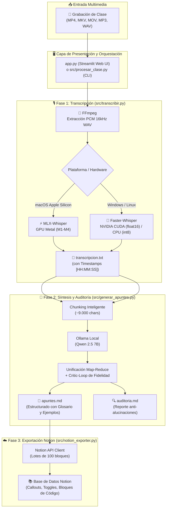

# 🎓 LectureFlow

> **Transforma grabaciones de clases y vídeos largos en apuntes técnicos estructurados en Notion — 100% local, privado y sin terminal.**

[](https://python.org)
[]()
[]()
[]()
[-green.svg)]()
[]()
[](https://opensource.org/licenses/MIT)

---

## 📖 Descripción del Proyecto

**LectureFlow** es una solución integral y modular diseñada bajo los principios de *Clean Architecture* para automatizar la transcripción, síntesis técnica y exportación a **Notion** de clases grabadas, ponencias y vídeos de larga duración.

El sistema opera bajo una filosofía **Zero-Terminal**: cualquier estudiante o desarrollador puede clonar el repositorio, ejecutar el asistente mediante accesos directos de un solo clic y gestionar todo el flujo desde una moderna interfaz web en **Streamlit**, sin tocar la consola de comandos en su día a día.

### 💡 El Problema que Resuelve
Tomar apuntes manuales durante sesiones técnicas de varias horas exige un esfuerzo cognitivo continuo que reduce drásticamente la capacidad de asimilar conceptos complejos en directo. Por otra parte, recurrir a herramientas comerciales SaaS o APIs en la nube conlleva costes por minuto inasumibles para un estudiante, cuotas mensuales recurrentes y la cesión de grabaciones privadas a servidores externos.

**LectureFlow derriba ambas barreras:**
- **Ilimitado y gratuito:** Procesa horas de vídeo sin coste por token ni límites de suscripción.
- **100% Confidencial:** Toda la inferencia (audio y texto) ocurre en tu hardware local.
- **Rigor técnico:** Genera resúmenes estructurados, glosarios explicativos, ejemplos del profesor con timestamps exactos y una auditoría automatizada contra alucinaciones.

---

## 🔄 Diagrama de Flujo del Pipeline



---

## 💡 Por qué nació LectureFlow

Este proyecto no surgió como un ejercicio teórico de laboratorio, sino como una herramienta de supervivencia real.

Mi compañero y yo estamos cursando el ciclo superior de **Desarrollo de Aplicaciones Web (DAW)** mientras trabajamos jornadas completas de 8 a 10 horas diarias en hostelería. Cuando sales de un turno agotador de pie, con la cabeza cargada y entras a una clase técnica de programación o bases de datos, te enfrentas a un dilema absurdo: o te dejas las pocas energías que te quedan en teclear a toda prisa apuntes que luego ni entiendes, o intentas prestar atención a la explicación del profesor y pierdes la mitad de los detalles técnicos.

Llegábamos reventados, y tomar notas a mano era una batalla perdida contra el cansancio. 

Nos preguntamos: **¿por qué no dejar que la máquina haga el trabajo pesado?** 

Queríamos poder sentarnos a escuchar, razonar la lógica del código y entender los conceptos en directo, sabiendo que una herramienta se encargaría de documentar la lección con fidelidad. No queríamos servicios de pago con suscripciones mensuales ni subir las clases privadas a servidores de terceros; necesitábamos un sistema que corriera en nuestros propios ordenadores, que aprovechara nuestra GPU local al volver a casa y que al día siguiente nos dejara en Notion unos apuntes estructurados, con bloques de código limpios y marcas de tiempo exactas para repasar justo lo que no quedó claro.

Así nació **LectureFlow**: una herramienta construida desde la trinchera para cambiar el cansancio por foco y transformar horas de clase en material de estudio listo para usar.

---

## 📁 Estructura del Proyecto

El repositorio adopta una arquitectura modular limpia con el código fuente desacoplado en el paquete `src/`, manteniendo puntos de entrada directos y lanzadores en la raíz:

```text
asistente-daw/
├── app.py                      # Interfaz web principal y dashboard (Streamlit)
├── Iniciar_Mac.command          # Lanzador 1-click para macOS (Zero-Terminal)
├── Iniciar_Windows.vbs         # Lanzador 1-click silencioso para Windows (Zero-Terminal)
├── requirements-mac.txt        # Dependencias de macOS (mlx-whisper, torch, streamlit)
├── requirements-win.txt        # Dependencias de Windows (faster-whisper, cuda dlls)
├── .env.example                # Plantilla para tokens y base de datos de Notion
├── .gitignore                  # Exclusiones blindadas (archivos pesados, .env, venv)
├── clases/                     # Repositorio local de asignaturas y clases procesadas
│   └── .gitkeep                # Preserva la estructura en el control de versiones
├── scripts/                    # Instaladores desatendidos y utilidades de arranque
│   ├── setup_mac.command       # Instalador automático para macOS
│   ├── setup_mac.sh            # Script bash de instalación y comprobación de Homebrew/FFmpeg
│   ├── setup_windows.bat       # Instalador batch para Windows (winget, venv, CUDA)
│   └── lanzador_win.bat        # Inicializador de Ollama y servidor Streamlit en Windows
├── src/                        # Paquete modular del núcleo de la aplicación
│   ├── __init__.py             # Inicializador y exports del paquete Python
│   ├── transcribir.py          # Extracción con FFmpeg y transcripción (Whisper large-v3-turbo)
│   ├── generar_apuntes.py      # Síntesis Map-Reduce, troceo de texto y critic-loop (Ollama)
│   ├── procesar_clase.py       # Orquestador del pipeline y gestión de rutas/carpetas
│   └── notion_exporter.py      # Conversor Markdown a bloques Notion con división en lotes
├── CONTRIBUTING.md             # Directrices de colaboración y desarrollo
├── LICENSE                     # Licencia MIT
└── README.md                   # Documentación oficial del proyecto
```

---

## 📌 Requisitos Previos

1. **Python 3.10+**: [python.org](https://www.python.org/downloads/) *(En Windows, asegúrate de marcar la casilla "Add Python to PATH")*.
2. **FFmpeg**: Requerido para la extracción de audio PCM a 16 kHz. *(Los instaladores automáticos en `scripts/` intentarán instalarlo mediante `winget` en Windows o `brew` en macOS)*.
3. **Ollama**: Descárgalo desde [ollama.com](https://ollama.com) y descarga el modelo Qwen 2.5:
   ```bash
   ollama run qwen2.5:7b
   ```
   *(También compatible con `ollama run qwen2.5:latest`)*.

---

## 🚀 Instalación y Puesta en Marcha (Zero-Terminal)

### 🪟 Windows (NVIDIA CUDA / CPU)

1. **Configuración Inicial (Solo una vez):**
   - Haz doble clic en el archivo `scripts/setup_windows.bat`.
   - El script creará el entorno virtual `venv_win`, instalará librerías CUDA de NVIDIA (`cublas`, `cudnn`), dependencias de `requirements-win.txt` y verificará FFmpeg.
2. **Uso Diario:**
   - Haz doble clic en `Iniciar_Windows.vbs` para iniciar Ollama, levantar el servidor Streamlit en segundo plano y abrir automáticamente el navegador.

### 🍎 macOS (Apple Silicon / Metal)

1. **Configuración Inicial (Solo una vez):**
   - Haz doble clic en `scripts/setup_mac.command` (o ejecuta `bash scripts/setup_mac.sh`).
   - El script creará el entorno virtual `venv`, instalará `mlx-whisper` optimizado para GPU Metal (chips M1 a M4) y verificará FFmpeg.
2. **Uso Diario:**
   - Haz doble clic en `Iniciar_Mac.command` para arrancar la interfaz web.

---

## 🔑 Configuración de Notion API

1. Crea una integración interna en [Notion Developers - My Integrations](https://www.notion.so/my-integrations).
2. Copia el **Internal Integration Secret**.
3. En la base de datos de Notion destinada a tus clases:
   - Haz clic en el botón de opciones `...` (arriba a la derecha) > **Conexiones** > Conecta tu integración.
4. Genera tu archivo `.env` en la raíz copiando `.env.example`:
   ```env
   NOTION_TOKEN=ntn_xxxxxxxxxxxxxxxxxxxxxxxxx
   NOTION_DATABASE_ID=xxxxxxxxxxxxxxxxxxxxxxxxxxxxxxxx
   ```

---

## ✨ Características Técnicas Destacadas

- **100% Local y Seguro**: Procesamiento íntegro sin envío de datos a servidores externos.
- **Tolerancia a Clases Extensas**: Buffer streaming en tiempo real y timeout ampliado a 4 horas (14.400s) para clases de más de 2 horas.
- **Critic-Loop Anti-Alucinaciones**: Cada conjunto de notas pasa por una auditoría automática de fidelidad que contrasta los apuntes generados contra la transcripción original.
- **Rendimiento de Hardware Nativo**:
  - **macOS:** Inferencia ultra-rápida en memoria unificada vía `mlx-whisper` (Apple Silicon).
  - **Windows:** Aceleración `faster-whisper` en `cuda` (`float16`) con degradación suave a `cpu` (`int8`).
- **Bloques Ricos en Notion**: Generación de toggles interactivos, callouts coloreados para advertencias y ejemplos, listas de control y bloques de código con sintaxis resaltada.

---

## 🛠️ Tecnologías Utilizadas

| Componente | Tecnología | Propósito |
| :--- | :--- | :--- |
| **Frontend & UI** | [Streamlit](https://streamlit.io/) | Dashboard interactivo, monitorización y vista previa |
| **Audio Processing** | [FFmpeg](https://ffmpeg.org/) | Extracción de audio PCM mono 16kHz |
| **Transcripción (macOS)** | [MLX Whisper](https://github.com/ml-explore/mlx-examples) | Transcripción acelerada por hardware Metal |
| **Transcripción (Windows)** | [Faster-Whisper](https://github.com/SYSTRAN/faster-whisper) | Transcripción acelerada por NVIDIA CUDA |
| **Modelo Whisper** | `large-v3-turbo` | Máxima precisión fonética y puntuación en español |
| **LLM Local** | [Ollama](https://ollama.com/) + Qwen 2.5 7B | Síntesis estructurada y auditoría técnica |
| **Integración Notion** | [Notion API](https://developers.notion.com/) | Publicación estructurada en bloques nativos |

---

## 📄 Licencia

Este proyecto está bajo la Licencia MIT. Consulta el archivo [LICENSE](LICENSE) para más detalles.
