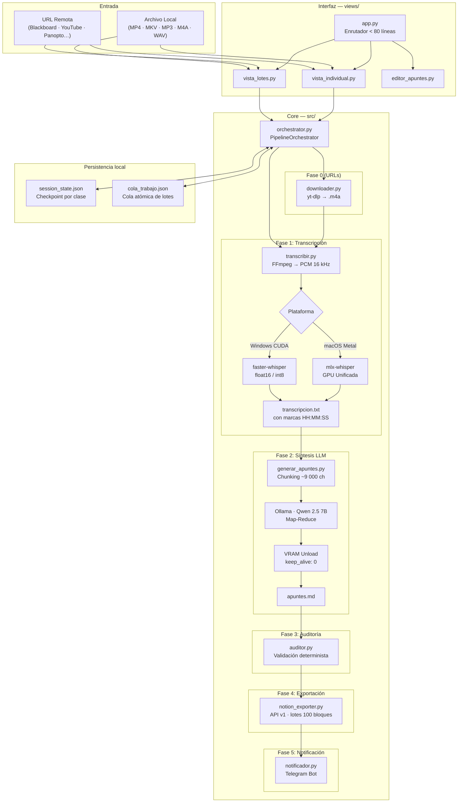

# LectureFlow

Pipeline local de estudio sin terminal: transcribe grabaciones de clase, genera apuntes estructurados con un LLM local y los exporta a Notion. Todo el procesamiento —audio, transcripción e inferencia— se ejecuta en el equipo del usuario con Whisper `large-v3-turbo` y Ollama/Qwen 2.5 7B. Ningún dato de audio o texto sale a servidores externos.

[](https://python.org)
[]()
[](https://opensource.org/licenses/MIT)

---

## Índice

- [Contexto del proyecto](#contexto-del-proyecto)
- [Arquitectura modular](#arquitectura-modular)
- [Diagrama de flujo de componentes](#diagrama-de-flujo-de-componentes)
- [Estructura del repositorio](#estructura-del-repositorio)
- [Gestión de hardware y estabilidad](#gestión-de-hardware-y-estabilidad)
- [Requisitos del sistema](#requisitos-del-sistema)
- [Instalación y configuración](#instalación-y-configuración)
- [Uso](#uso)
- [Extracción desde Blackboard / Campus Virtual](#extracción-desde-blackboard--campus-virtual)
- [Notificaciones Telegram](#notificaciones-telegram)
- [Tecnologías](#tecnologías)
- [Licencia](#licencia)
- [Hoja de Ruta (Roadmap)](#hoja-de-ruta-roadmap)

---

## Contexto del proyecto

LectureFlow se desarrolló durante el ciclo formativo de Grado Superior de **Desarrollo de Aplicaciones Web (DAW)** compaginado con jornadas de trabajo de 8 a 10 horas diarias. En ese contexto, tomar apuntes manuales durante sesiones técnicas de varias horas dejaba de ser viable sin comprometer la comprensión activa en clase.

La necesidad concreta era disponer de un sistema que:

- Grabara la clase y generara documentación técnica estructurada sin intervención manual.
- Funcionara sin suscripciones ni APIs de pago externas.
- Ejecutara toda la inferencia localmente, aprovechando la GPU disponible (Metal en Apple Silicon, CUDA en Windows).
- Pudiera extraer audio de plataformas educativas con autenticación (Blackboard, Panopto, Moodle) sin descargar el archivo completo de vídeo.

---

## Arquitectura modular

La interfaz de usuario está completamente desacoplada del motor de procesamiento mediante un paquete `views/` independiente. `app.py` actúa como enrutador minimalista (< 80 líneas) y delega toda la lógica a los módulos correspondientes.

### Paquete `views/` — Interfaz de usuario

| Módulo | Responsabilidad |
|--------|----------------|
| `estilos.py` | Constantes CSS globales (`CSS_GLOBAL`), fuentes Inter/JetBrains Mono, `aplicar_estilos()`, `render_header()`, `render_terminal_topbar()` |
| `sidebar.py` | `renderizar_sidebar(root_dir) → dict` — escaneo de `clases/`, botones de navegación, renombrado y eliminación de asignaturas |
| `vista_individual.py` | `renderizar_vista_individual(root_dir, orquestador)` — formulario de subida, selector de archivo local, campo de URL remota, diálogo de checkpoint y consola de progreso en tiempo real |
| `vista_lotes.py` | `renderizar_vista_lotes(root_dir, cola_manager, orquestador)` — formulario multi-archivo, bloque de URLs en masa (una por línea), panel de métricas y bucle secuencial de ejecución |
| `editor_apuntes.py` | `renderizar_editor_apuntes(directorio_clase)` — visor/editor Markdown con backups `.bak`, botón de re-auditoría determinista y re-exportación a Notion |

### Capa core `src/` — Lógica y orquestación

| Módulo | Responsabilidad |
|--------|----------------|
| `orchestrator.py` | `PipelineOrchestrator` — motor central desacoplado de la UI; ejecuta las cinco fases secuenciales con callbacks de progreso y línea |
| `downloader.py` | `descargar_audio(url, directorio, nombre_base, callback_progreso)` — descarga exclusiva de pista de audio via yt-dlp con `FFmpegExtractAudio → m4a` |
| `transcribir.py` | Extracción de audio PCM con FFmpeg y transcripción Whisper con timestamps `[HH:MM:SS]` por segmento |
| `generar_apuntes.py` | Chunking ~9 000 caracteres, síntesis Map-Reduce con Ollama/Qwen 2.5 y descarga determinista de VRAM post-inferencia |
| `auditor.py` | Validación determinista de apuntes: cobertura de timestamps, sintaxis de bloques de código y orden cronológico |
| `cola_manager.py` | `ColaManager` — persistencia atómica de `cola_trabajo.json`, gestión de estados y `reconciliar_trabajos_huerfanos()` |
| `checkpoint_manager.py` | `CheckpointManager` — persistencia de sesión en `session_state.json`; permite reanudar transcripciones interrumpidas |
| `notion_exporter.py` | Conversión Markdown → bloques Notion API v1 en lotes de 100 |
| `notificador.py` | Alertas Telegram por clase completada, balance de lotes y errores críticos |

---

## Diagrama de flujo de componentes


```mermaid
flowchart TD
    subgraph ENTRADA["Entrada"]
        A1["Archivo Local\n(MP4 · MKV · MP3 · M4A · WAV)"]
        A2["URL Remota\n(Blackboard · YouTube · Panopto…)"]
    end

    subgraph UI["Interfaz — views/"]
        B["app.py\nEnrutador < 80 líneas"]
        B --> B1["vista_individual.py"]
        B --> B2["vista_lotes.py"]
        B --> B3["editor_apuntes.py"]
    end

    subgraph CORE["Core — src/"]
        C["orchestrator.py\nPipelineOrchestrator"]

        subgraph F0["Fase 0 (URLs)"]
            D["downloader.py\nyt-dlp → .m4a"]
        end

        subgraph F1["Fase 1: Transcripción"]
            E["transcribir.py\nFFmpeg → PCM 16 kHz"]
            E --> E1{"Plataforma"}
            E1 -->|"macOS Metal"| E2["mlx-whisper\nGPU Unificada"]
            E1 -->|"Windows CUDA"| E3["faster-whisper\nfloat16 / int8"]
            E2 & E3 --> E4["transcripcion.txt\ncon marcas HH:MM:SS"]
        end

        subgraph F2["Fase 2: Síntesis LLM"]
            F["generar_apuntes.py\nChunking ~9 000 ch"]
            F --> G["Ollama · Qwen 2.5 7B\nMap-Reduce"]
            G --> G1["VRAM Unload\nkeep_alive: 0"]
            G1 --> H["apuntes.md"]
        end

        subgraph F3["Fase 3: Auditoría"]
            I["auditor.py\nValidación determinista"]
        end

        subgraph F4["Fase 4: Exportación"]
            J["notion_exporter.py\nAPI v1 · lotes 100 bloques"]
        end

        subgraph F5["Fase 5: Notificación"]
            K["notificador.py\nTelegram Bot"]
        end
    end

    subgraph PERSISTENCIA["Persistencia local"]
        P1["session_state.json\nCheckpoint por clase"]
        P2["cola_trabajo.json\nCola atómica de lotes"]
    end

    A1 --> B1
    A2 --> B1
    A2 --> B2
    A1 --> B2
    B1 & B2 --> C
    C --> D --> E
    C --> E
    E4 --> F
    H --> I --> J --> K
    C <--> P1
    C <--> P2
```

---

## Estructura del repositorio

```text
asistente-daw/
├── app.py                          # Enrutador principal Streamlit (< 80 líneas)
├── Iniciar_Mac.command             # Lanzador de un clic para macOS
├── Iniciar_Windows.vbs             # Lanzador silencioso para Windows
├── requirements-mac.txt            # Dependencias macOS
├── requirements-win.txt            # Dependencias Windows
├── .env.example                    # Plantilla de variables de entorno
├── .gitignore
│
├── views/                          # Paquete de interfaz de usuario (Streamlit)
│   ├── __init__.py
│   ├── estilos.py                  # CSS global, fuentes personalizadas
│   ├── sidebar.py                  # Explorador de asignaturas y navegación
│   ├── vista_individual.py         # Subida local · URL remota · consola en tiempo real
│   ├── vista_lotes.py              # Cola de archivos y URLs · métricas · ejecución secuencial
│   └── editor_apuntes.py           # Editor Markdown · backups · re-auditoría · Notion
│
├── src/                            # Capa core — orquestación y lógica
│   ├── __init__.py
│   ├── orchestrator.py             # PipelineOrchestrator — motor central desacoplado
│   ├── downloader.py               # Descarga de audio remoto via yt-dlp
│   ├── transcribir.py              # Fase 1 — FFmpeg + Whisper con timestamps
│   ├── generar_apuntes.py          # Fase 2 — Síntesis LLM + descarga VRAM
│   ├── auditor.py                  # Auditoría determinista de apuntes
│   ├── cola_manager.py             # Cola persistente de trabajos por lotes
│   ├── checkpoint_manager.py       # Checkpoint y reanudación de sesiones
│   ├── notion_exporter.py          # Exportación a Notion API v1
│   ├── notificador.py              # Alertas Telegram
│   └── procesar_clase.py           # Punto de entrada CLI (sin UI)
│
├── clases/                         # Salida local organizada por materia y clase
│   └── <Asignatura>/<Clase>/
│       ├── audio_original.m4a      # Audio descargado (URLs remotas)
│       ├── transcripcion.txt       # Transcripción con marcas de tiempo
│       ├── apuntes.md              # Apuntes generados por el LLM
│       ├── apuntes.md.bak          # Backup previo a ediciones manuales
│       └── session_state.json      # Checkpoint de la sesión de procesamiento
│
├── scripts/
│   ├── setup_mac.command           # Instalador macOS (crea venv, instala FFmpeg)
│   ├── setup_mac.sh
│   ├── setup_windows.bat           # Instalador Windows (crea venv_win, verifica CUDA)
│   └── lanzador_win.bat            # Arranca Ollama y el servidor Streamlit en Windows
│
├── tests/
│   └── test_auditor.py
├── CONTRIBUTING.md
├── LICENSE
└── README.md
```

---

## Gestión de hardware y estabilidad

### Política de VRAM determinista

Ollama mantiene el modelo cargado en VRAM durante 5 minutos por defecto (`keep_alive=5m`) después de cada petición. En equipos con GPU de 8 GB, esto causa colisiones de memoria cuando Whisper intenta cargar su propio modelo antes de que Ollama libere la VRAM. En macOS, la memoria unificada comparte el presupuesto entre CPU y GPU, por lo que el problema de contención también aplica con memorias de 8 GB.

**Solución implementada:** `src/generar_apuntes.py` envía una llamada de descarga determinista con `keep_alive: 0` inmediatamente tras finalizar cada petición de síntesis, independientemente de si la petición tuvo éxito o falló. Esto se ejecuta dentro de un bloque `finally` para garantizar la liberación incluso ante errores:

```python
# src/generar_apuntes.py — descarga determinista de VRAM
try:
    self._ejecutar_subproceso_stream(cmd_apuntes)
finally:
    descargar_modelo_ollama(MODELO_OLLAMA)  # keep_alive: 0
```

La función `descargar_modelo_ollama()` realiza una llamada `POST /api/generate` con `keep_alive: 0`, que instruye a Ollama a expulsar el modelo de VRAM inmediatamente, dejando la GPU disponible para la siguiente fase de transcripción en la cola de lotes.

### Cola de procesamiento y tolerancia a fallos

#### Persistencia atómica de la cola (`cola_trabajo.json`)

`ColaManager` mantiene la lista de trabajos en un archivo JSON cuya escritura se realiza de forma atómica mediante un archivo temporal seguido de `os.replace()`. Esto garantiza que la cola nunca quede en un estado corrupto por interrupciones a mitad de escritura (cierres forzosos, pérdidas de alimentación). Cada trabajo registra su estado (`pendiente`, `en_progreso`, `completado`, `error`) y el mensaje de error truncado en caso de fallo.

#### Reconciliación de trabajos huérfanos

Cuando el proceso Streamlit se interrumpe mientras un trabajo se encuentra en estado `en_progreso` (cierre del navegador, caída de WebSocket, reinicio del sistema), el trabajo queda bloqueado en ese estado y no se procesa en reinicios posteriores.

Al arrancar, `app.py` invoca `cola_manager.reconciliar_trabajos_huerfanos()`, que reclasifica todos los trabajos `en_progreso` a `pendiente`. En la siguiente ejecución de la cola, esos trabajos se retoman desde el principio o, si existe un checkpoint de sesión válido, desde el último segmento transcrito.

#### Checkpoint de sesión (`session_state.json`)

`CheckpointManager` persiste el estado de cada sesión de transcripción en el directorio de la clase: número de segmentos transcritos, último timestamp cubierto y fase actual del pipeline. Si el proceso se interrumpe durante la transcripción de una clase larga, la interfaz detecta el checkpoint al volver a seleccionar el archivo y ofrece:

- **Reanudar:** continúa desde el último segmento registrado, omitiendo el audio ya procesado.
- **Empezar de nuevo:** purga el checkpoint y ejecuta el pipeline completo.

---

## Requisitos del sistema

### Comunes

| Requisito | Versión mínima | Notas |
|-----------|---------------|-------|
| Python | 3.10 | Añadir al PATH en Windows |
| FFmpeg | cualquiera estable | Instalado por los scripts de setup |
| Ollama | cualquiera estable | [ollama.com](https://ollama.com) |
| yt-dlp | 2024.x o posterior | Instalado automáticamente via `requirements` |

### Windows (NVIDIA CUDA)

| Requisito | Detalle |
|-----------|---------|
| CUDA Toolkit | 12.x |
| VRAM recomendada | 8 GB para `float16`; con menos, el sistema degrada a `int8` en CPU |
| Driver NVIDIA | compatible con CUDA 12 |

### macOS (Apple Silicon)

| Requisito | Detalle |
|-----------|---------|
| Chip | M1, M2, M3 o M4 |
| Memoria unificada | 8 GB mínimo; 16 GB recomendado para clases largas |
| Homebrew | para instalar FFmpeg automáticamente |

---

## Instalación y configuración

### 1. Clonar el repositorio

```bash
git clone https://github.com/<usuario>/asistente-daw.git
cd asistente-daw
```

### 2. Ejecutar el instalador de dependencias

**macOS:**

```bash
bash scripts/setup_mac.sh
```

O bien hacer doble clic en `scripts/setup_mac.command`.

**Windows:**

Doble clic en `scripts/setup_windows.bat`.

El script crea el entorno virtual (`venv` en macOS, `venv_win` en Windows), instala las dependencias del archivo de requisitos correspondiente, verifica la presencia de FFmpeg e instala yt-dlp.

### 3. Descargar el modelo de Ollama

```bash
ollama pull qwen2.5:7b
```

El modelo Whisper `large-v3-turbo` se descarga automáticamente en el primer uso.

### 4. Configurar las variables de entorno

Copiar `.env.example` a `.env` y rellenar los valores:

```bash
cp .env.example .env
```

```env
# ── Notion ────────────────────────────────────────────────────────────────────
NOTION_TOKEN=ntn_xxxxxxxxxxxxxxxxxxxxxxxxxxxxxxxxxxxxxxxxxxxxxxxx
NOTION_DATABASE_ID=xxxxxxxxxxxxxxxxxxxxxxxxxxxxxxxx

# ── Telegram (opcional) ───────────────────────────────────────────────────────
TELEGRAM_BOT_TOKEN=1234567890:ABCdefGHIjklMNOpqrSTUvwxYZ
TELEGRAM_CHAT_ID=123456789
```

#### Obtener las credenciales de Notion

1. Acceder a [notion.so/my-integrations](https://www.notion.so/my-integrations) y crear una integración interna.
2. Copiar el **Internal Integration Secret** como valor de `NOTION_TOKEN`.
3. Abrir la base de datos de Notion de destino, seleccionar "Conexiones" en el menú de opciones y conectar la integración creada.
4. Copiar el ID de la base de datos desde la URL: `https://www.notion.so/<workspace>/<DATABASE_ID>?v=...`.

---

## Uso

### Lanzadores de un clic (modo habitual)

| Sistema | Archivo |
|---------|---------|
| macOS | `Iniciar_Mac.command` — activa el entorno virtual y ejecuta `streamlit run app.py` |
| Windows | `Iniciar_Windows.vbs` — inicia Ollama en segundo plano, lanza el servidor Streamlit y abre el navegador en `http://localhost:8501` |

### Ejecución manual

```bash
# Activar el entorno virtual
source venv/bin/activate          # macOS
venv_win\Scripts\activate.bat     # Windows

# Iniciar la interfaz web
streamlit run app.py

# Ejecutar el pipeline completo desde CLI (sin interfaz)
python src/procesar_clase.py "Nombre Materia" "Nombre Clase" ruta/archivo.mp4
```

### Flujo de trabajo desde la interfaz

1. **Nueva Clase** — elegir asignatura, nombre del tema y origen del material.
2. **Origen del material:**
   - `Subir nuevo archivo` — arrastrar MP4, MKV, MP3, M4A o WAV.
   - `Usar un archivo ya guardado` — seleccionar de los archivos ya presentes en `clases/`.
   - `URL / Enlace remoto` — pegar un enlace de Blackboard, YouTube, Panopto u otra plataforma compatible con yt-dlp.
3. Pulsar **Iniciar Procesamiento** — la barra de progreso y la consola muestran cada fase en tiempo real.
4. Al finalizar, los apuntes aparecen en pantalla con la opción de exportarlos a Notion.
5. Seleccionar una clase en el panel lateral para acceder al **Editor de Apuntes** con edición en caliente y re-auditoría.

### Procesamiento por lotes

1. Pulsar **Por Lotes** en el panel lateral.
2. Añadir archivos locales con el selector múltiple o pegar varias URLs (una por línea) en el área de texto.
3. Pulsar **Iniciar Cola** — el sistema procesa cada trabajo de forma secuencial, actualiza las métricas en tiempo real y envía una notificación Telegram al completar el lote.

---

## Extracción desde Blackboard / Campus Virtual

### Por qué no se descarga el vídeo completo

Los vídeos de Blackboard Collaborate, Panopto u otras plataformas educativas suelen pesar entre 1 y 3 GB y están protegidos por sesiones autenticadas. Descargarlos directamente requiere autenticación de browser, almacenamiento adicional y tiempo de transferencia.

LectureFlow solo necesita la **pista de audio** (típicamente 50–150 MB en M4A). yt-dlp selecciona automáticamente el stream de audio de menor tamaño disponible (`bestaudio/best`) y descarta el vídeo, reduciendo el tiempo de descarga a menos de un minuto en conexiones normales.

### Configurar el Bookmarklet "Extraer Blackboard"

El bookmarklet extrae la URL del stream de vídeo activo desde cualquier reproductor HTML5 y la copia al portapapeles, lista para pegarla en LectureFlow.

**Pasos de configuración (se hace una sola vez):**

1. Mostrar la barra de marcadores/favoritos del navegador (`Ctrl+Shift+B` en Chrome/Edge, `Cmd+Shift+B` en Safari).
2. Hacer clic derecho sobre la barra de marcadores → **Añadir página** o **Nuevo marcador**.
3. En el campo **Nombre**, escribir: `Extraer Blackboard`
4. En el campo **URL / Dirección**, pegar el siguiente código JavaScript completo:

```javascript
javascript:(function(){const v=document.querySelector('video')||document.querySelector('source');if(v&&v.src){navigator.clipboard.writeText(v.src).then(()=>{alert('✅ Enlace copiado al portapapeles:\n\n'+v.src.substring(0,100)+'...');});}else{alert('❌ Dale al Play al vídeo primero y vuelve a pulsar este botón.');}})();
```

5. Guardar el marcador.

### Flujo de uso diario (~30 segundos)

```
1. Abrir la clase grabada en Blackboard / Campus Virtual
2. Pulsar ▶ Play en el reproductor de vídeo (esperar 2–3 segundos)
3. Hacer clic en el marcador "Extraer Blackboard" de la barra del navegador
4. El enlace del stream se copia automáticamente al portapapeles
5. Ir a LectureFlow → Nueva Clase → URL / Enlace remoto
6. Pegar el enlace (Ctrl+V / Cmd+V) y pulsar Iniciar Procesamiento
```

yt-dlp descarga exclusivamente la pista de audio (.m4a) y el pipeline de transcripción y síntesis se ejecuta de forma automática.

> **Nota:** El enlace de stream suele contener un token de sesión con caducidad. Si la descarga falla con un error 403, recargar la página de Blackboard, reproducir el vídeo de nuevo y repetir el proceso del bookmarklet.

---

## Notificaciones Telegram

LectureFlow envía notificaciones automáticas a un bot de Telegram configurado en `.env`. Si los valores no están definidos, las notificaciones se deshabilitan silenciosamente sin afectar al pipeline.

### Configuración del bot

1. Hablar con [@BotFather](https://t.me/BotFather) en Telegram → `/newbot` → seguir el asistente → copiar el token generado.
2. Enviar `/start` al bot recién creado.
3. Visitar `https://api.telegram.org/bot<TOKEN>/getUpdates` y copiar el valor `"id"` del primer resultado como `TELEGRAM_CHAT_ID`.
4. Añadir ambos valores al archivo `.env`:

```env
TELEGRAM_BOT_TOKEN=1234567890:ABCdefGHIjklMNOpqrSTUvwxYZ
TELEGRAM_CHAT_ID=123456789
```

### Tipos de alertas

| Evento | Contenido del mensaje |
|--------|-----------------------|
| **Clase individual completada** | Nombre de la clase, duración del proceso, enlace directo a la página de Notion generada |
| **Lote completado** | Total de trabajos procesados, número de éxitos y número de errores |
| **Error crítico** | Nombre del contexto (clase o materia), primeras 300 caracteres del mensaje de excepción |

---

## Tecnologías

| Componente | Tecnología |
|------------|-----------|
| Interfaz web | [Streamlit](https://streamlit.io/) |
| Descarga de audio remoto | [yt-dlp](https://github.com/yt-dlp/yt-dlp) + FFmpeg Extract Audio → M4A |
| Extracción de audio local | [FFmpeg](https://ffmpeg.org/) — PCM mono 16 kHz |
| Transcripción macOS | [mlx-whisper](https://github.com/ml-explore/mlx-examples) — aceleración Metal |
| Transcripción Windows | [faster-whisper](https://github.com/SYSTRAN/faster-whisper) — CUDA 12 / CPU int8 |
| Modelo de transcripción | Whisper `large-v3-turbo` |
| Inferencia LLM | [Ollama](https://ollama.com/) con Qwen 2.5 7B — VRAM unload determinista |
| Exportación | [Notion API v1](https://developers.notion.com/) — lotes de 100 bloques |
| Notificaciones | Telegram Bot API |

---

## Licencia

MIT. Ver [LICENSE](LICENSE).

---

## Hoja de Ruta (Roadmap)

- [x] Checkpoint y reanudación ante fallos de energía o sesión. Cada sesión de procesamiento persiste su estado en `session_state.json` (segmentos transcritos, timestamp, fase actual). Si el proceso se interrumpe antes de finalizar, la interfaz detecta el estado incompleto y ofrece continuar desde donde se quedó o comenzar de nuevo.

- [x] Cola persistente de procesamiento por lotes con tolerancia a fallos. `cola_trabajo.json` almacena el estado de cada trabajo de forma atómica. `reconciliar_trabajos_huerfanos()` recupera automáticamente los trabajos interrumpidos en cada arranque.

- [x] Descarga de audio remoto desde plataformas educativas. yt-dlp extrae exclusivamente la pista de audio de cualquier URL compatible (YouTube, Blackboard, Panopto, Vimeo, etc.) y la convierte a M4A antes de la transcripción. Compatible con el Bookmarklet de extracción de stream autenticado.

- [x] Arquitectura modular MVC. `app.py` reducido a enrutador de < 80 líneas. Vistas encapsuladas en `views/`. Motor de procesamiento completamente desacoplado en `src/orchestrator.py`.

- [x] Descarga determinista de VRAM tras inferencia Ollama. Llamada `keep_alive: 0` en bloque `finally` para evitar colisiones OOM entre Ollama y Whisper en GPUs de 8 GB.

- [ ] Segmentación semántica por pausas y cambios de contexto. Sustituir la división por número fijo de caracteres por un algoritmo que detecte silencios prolongados y transiciones temáticas para generar fragmentos más coherentes y reducir la pérdida de contexto en los límites de bloque.

- [ ] Deep-linking local desde marcas de tiempo hacia reproductores multimedia de escritorio. Generar hipervínculos del tipo `[HH:MM:SS]` en los apuntes que, al hacer clic, abran el archivo de vídeo o audio en el reproductor predeterminado del sistema operativo y salten directamente al instante correspondiente.

- [ ] Resumen ejecutivo automático por asignatura. Generar un documento consolidado por materia que sintetice los conceptos principales de todas las clases procesadas, ordenados cronológicamente y con referencias cruzadas a los apuntes individuales en Notion.
