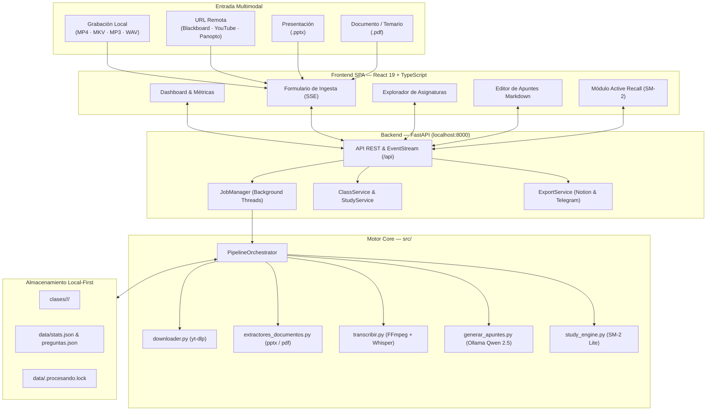

# LectureFlow — AI Study Suite

> **Suite académica local-first para la ingesta multimodal de clases, síntesis pedagógica estructurada con LLMs locales y repaso espaciado activo (SM-2).**

LectureFlow procesa grabaciones de audio/vídeo, enlaces web, presentaciones PowerPoint (`.pptx`) y documentos de temario (`.pdf`), transformándolos en apuntes estructurados en Markdown, fichas exportables a Notion, alertas a Telegram y bancos de evaluación interactivos con repetición espaciada.

[](https://python.org)
[](https://fastapi.tiangolo.com)
[](https://react.dev)
[](https://tailwindcss.com)
[](https://ollama.com)
[]()
[](https://opensource.org/licenses/MIT)

---

## 🏗️ Arquitectura del Sistema

El sistema utiliza una arquitectura desacoplada basada en el principio **local-first** y la **fuente de verdad en el sistema de archivos**:

```text
                  ┌─────────────────────────────┐
                  │    React 19 + TypeScript    │  (Tailwind CSS v4, Obsidian Flow)
                  │       (localhost:8000)      │
                  └──────────────┬──────────────┘
                                 │ HTTP REST / SSE (EventStream)
                                 ▼
                  ┌─────────────────────────────┐
                  │           FastAPI           │  (Uvicorn ASGI)
                  │   API REST + Static Server  │
                  └──────────────┬──────────────┘
                                 │
                  ┌──────────────┴──────────────┐
                  ▼                             ▼
       ┌─────────────────────┐       ┌─────────────────────┐
       │   Services Layer    │       │     Job Manager     │
       │  (Class, Study,     │       │  (Procesos async,   │
       │   Export Services)  │       │   Lockfile control) │
       └──────────┬──────────┘       └──────────┬──────────┘
                  │                             │
                  ▼                             ▼
       ┌───────────────────────────────────────────────────┐
       │                 LectureFlow Core                  │
       │  • PipelineOrchestrator  • Whisper (Subproceso)  │
       │  • PyMuPDF / pptx        • Ollama (Qwen 2.5 7B)   │
       │  • StudyEngine (SM-2)    • Notion & Telegram APIs │
       └──────────────────────────┬────────────────────────┘
                                  │
                                  ▼
                     ┌─────────────────────────┐
                     │   Filesystem Storage    │
                     │  clases/ & data/*.json  │
                     └─────────────────────────┘
```

---

## Índice

- [Contexto del proyecto](#contexto-del-proyecto)
- [Características principales](#características-principales)
- [Arquitectura del Sistema](#️-arquitectura-del-sistema)
- [Diagrama de flujo de componentes](#diagrama-de-flujo-de-componentes)
- [Estructura del repositorio](#estructura-del-repositorio)
- [Gestión de hardware y estabilidad](#gestión-de-hardware-y-estabilidad)
- [Requisitos del sistema](#requisitos-del-sistema)
- [Instalación y configuración](#instalación-y-configuración)
- [Uso](#uso)
- [Extracción desde Blackboard / Campus Virtual](#extracción-desde-blackboard--campus-virtual)
- [Notificaciones Telegram](#notificaciones-telegram)
- [Tecnologías](#tecnologías)
- [Licencia](#licencia)
- [Hoja de Ruta (Roadmap)](#hoja-de-ruta-roadmap)

---

## Contexto del proyecto

LectureFlow se desarrolló durante el ciclo formativo de Grado Superior de **Desarrollo de Aplicaciones Web (DAW)** compaginado con jornadas de trabajo de 8 a 10 horas diarias. En ese contexto, tomar apuntes manuales durante sesiones técnicas de varias horas dejaba de ser viable sin comprometer la comprensión activa en clase.

La necesidad concreta era disponer de un sistema que:

- Grabara la clase y generara documentación técnica estructurada sin intervención manual.
- Admitiera tanto clases orales grabadas como diapositivas (`.pptx`) y temarios oficiales (`.pdf`).
- Funcionara sin suscripciones ni APIs de pago externas.
- Ejecutara toda la inferencia localmente, aprovechando la GPU disponible (Metal en Apple Silicon, CUDA en Windows).
- Extrajera audio de plataformas educativas con autenticación (Blackboard, Panopto, Moodle) sin descargar el archivo completo de vídeo.
- Facilitara el repaso sistemático a largo plazo mediante técnicas pedagógicas de recuerdo activo (*Active Recall* y repetición espaciada *SM-2*).

---

## Características principales

- **Ingesta Multimodal Universal:**
  - **Archivos de audio/vídeo locales:** MP4, MKV, MP3, M4A y WAV.
  - **Presentaciones PowerPoint (`.pptx`):** Extracción nativa de textos de diapositivas y notas del orador mediante `python-pptx`.
  - **Documentos de texto (`.pdf`):** Extracción estructurada página a página con `pypdf`.
  - **Enlaces remotos:** Extracción de pistas de audio con `yt-dlp` desde Blackboard, YouTube o Panopto sin descargar el vídeo.
- **Síntesis Pedagógica Local con LLMs:**
  - División inteligente por fragmentos (*chunking* ~9 000 caracteres) y síntesis Map-Reduce usando **Ollama / Qwen 2.5 7B**.
  - Formato Markdown riguroso con glosario de términos clave, ejemplos de código y marcas de tiempo `[HH:MM:SS]`.
  - Política de **descarga determinista de VRAM** (`keep_alive: 0`) para evitar colisiones OOM entre Whisper y Ollama.
- **Active Recall & Repetición Espaciada (SM-2 Lite):**
  - Generación automática de preguntas tipo test de 4 opciones por cada clase procesada.
  - Algoritmo SM-2 Lite con persistencia local en `data/stats.json` y `data/preguntas.json`.
  - Interfaz interactiva de práctica con conteo de rachas, tarjetas pendientes de repaso y feedback explicativo inmediato.
- **Visor y Editor de Apuntes en Vivo:**
  - Interfaz estilo *Obsidian Flow* con renderizado tipográfico refinado y editor en caliente.
  - Guardado atómico con preservación de copias de seguridad `.bak`.
- **Exportación e Integraciones:**
  - **Notion API v1:** Envío directo estructurado en lotes de bloques a bases de datos de Notion.
  - **Telegram Bot:** Notificaciones instantáneas al completar el procesamiento o ante errores críticos.
- **Telemetría en Tiempo Real (SSE):**
  - Monitorización paso a paso del progreso vía *Server-Sent Events* con barra de progreso y mensajes informativos en vivo.

---

## Diagrama de flujo de componentes


```mermaid
flowchart TD
    subgraph ENTRADA["Entrada Multimodal"]
        A1["Grabación Local\n(MP4 · MKV · MP3 · WAV)"]
        A2["URL Remota\n(Blackboard · YouTube · Panopto)"]
        A3["Presentación\n(.pptx)"]
        A4["Documento / Temario\n(.pdf)"]
    end

    subgraph CLIENTE["Frontend SPA — React 19 + TypeScript"]
        UI1["Dashboard & Métricas"]
        UI2["Formulario de Ingesta (SSE)"]
        UI3["Explorador de Asignaturas"]
        UI4["Editor de Apuntes Markdown"]
        UI5["Módulo Active Recall (SM-2)"]
    end

    subgraph SERVIDOR["Backend — FastAPI (localhost:8000)"]
        API["API REST & EventStream (/api)"]
        JM["JobManager (Background Threads)"]
        CS["ClassService & StudyService"]
        ES["ExportService (Notion & Telegram)"]
    end

    subgraph CORE["Motor Core — src/"]
        ORCH["PipelineOrchestrator"]
        DOWN["downloader.py (yt-dlp)"]
        DOCS["extractores_documentos.py (pptx / pdf)"]
        TRANS["transcribir.py (FFmpeg + Whisper)"]
        LLM["generar_apuntes.py (Ollama Qwen 2.5)"]
        SE["study_engine.py (SM-2 Lite)"]
    end

    subgraph STORAGE["Almacenamiento Local-First"]
        FS1["clases/<materia>/<clase>/"]
        FS2["data/stats.json & preguntas.json"]
        FS3["data/.procesando.lock"]
    end

    A1 & A2 & A3 & A4 --> UI2
    UI1 & UI2 & UI3 & UI4 & UI5 <--> API
    API --> JM & CS & ES
    JM --> ORCH
    ORCH --> DOWN & DOCS & TRANS & LLM & SE
    ORCH <--> STORAGE
```

---

## Estructura del repositorio

```text
asistente-daw/
├── Iniciar_Mac.command             # Lanzador de un clic para macOS (FastAPI + React en :8000)
├── Iniciar_Windows.vbs             # Lanzador silencioso para Windows
├── requirements-mac.txt            # Dependencias Python para macOS (Metal)
├── requirements-win.txt            # Dependencias Python para Windows (CUDA)
├── .env.example                    # Plantilla de variables de entorno (Notion / Telegram)
├── .gitignore                      # Exclusiones de Git
│
├── frontend/                       # Aplicación SPA (React 19, TypeScript, Vite, Tailwind v4)
│   ├── package.json
│   ├── vite.config.ts              # Configuración de proxy a :8000 y compilación
│   ├── src/
│   │   ├── App.tsx                 # Enrutador y layout principal Obsidian Flow
│   │   ├── main.tsx
│   │   ├── index.css               # Tokens de diseño y paleta oscura
│   │   ├── components/             # Componentes React
│   │   │   ├── Header.tsx          # Barra superior y estado de conexión
│   │   │   ├── Sidebar.tsx         # Árbol de asignaturas, clases y acciones rápidas
│   │   │   ├── Dashboard.tsx       # Métricas de estudio, racha e inicio de tareas
│   │   │   ├── NewClassForm.tsx    # Ingesta multimodal con barra SSE de progreso
│   │   │   ├── NotesEditor.tsx     # Visor/Editor Markdown, export a Notion y Telegram
│   │   │   └── PracticeSession.tsx # Sesión interactiva de repaso espaciado SM-2
│   │   ├── services/
│   │   │   └── api.ts              # Cliente API tipado y consumidor de EventSource
│   │   └── types/                  # Definiciones TypeScript de datos
│   └── dist/                       # Build estático servido directamente por FastAPI
│
├── src/                            # Backend FastAPI y lógica del núcleo
│   ├── api/
│   │   ├── __init__.py
│   │   └── main.py                 # Servidor FastAPI REST + montaje SPA estática
│   ├── services/
│   │   ├── __init__.py
│   │   ├── class_service.py        # Gestión de archivos, notas y carpetas en clases/
│   │   ├── job_service.py          # Gestor de tareas asíncronas con streaming SSE
│   │   ├── study_service.py        # Servicios del algoritmo SM-2 y banco de preguntas
│   │   └── export_service.py       # Servicios de exportación a Notion y avisos Telegram
│   ├── orchestrator.py             # PipelineOrchestrator — motor central desacoplado
│   ├── extractores_documentos.py   # Extractores nativos de diapositivas PPTX y PDFs
│   ├── downloader.py               # Descarga de audio remoto via yt-dlp
│   ├── transcribir.py              # Extracción PCM con FFmpeg + Whisper (Metal/CUDA)
│   ├── generar_apuntes.py          # Síntesis LLM estructurada + descarga VRAM
│   ├── study_engine.py             # Motor matemático SM-2 Lite y generador de preguntas
│   ├── auditor.py                  # Auditoría determinista de apuntes
│   ├── notion_exporter.py          # Exportación a Notion API v1
│   ├── notificador.py              # Alertas Telegram
│   └── procesar_clase.py           # CLI sin interfaz gráfica
│
├── views/                          # Interfaz legacy Streamlit (soporte secundario)
│   ├── app.py                      # Enrutador Streamlit
│   └── ...
│
├── clases/                         # Repositorio local de asignaturas y apuntes
│   └── <Materia>/<Clase>/
│       ├── audio_original.m4a      # Pista de audio descargada (si aplica)
│       ├── transcripcion.txt       # Transcripción con marcas de tiempo
│       ├── apuntes.md              # Apuntes estructurados en Markdown
│       ├── preguntas.json          # Banco de preguntas SM-2 de la clase
│       └── session_state.json      # Checkpoint de la sesión
│
├── data/                           # Persistencia global de estudio
│   ├── stats.json                  # Racha, tarjetas revisadas y estadísticas globales
│   └── preguntas.json              # Banco unificado de preguntas y estados SM-2
│
├── scripts/
│   ├── setup_mac.sh / .command     # Asistente de instalación en macOS
│   ├── setup_windows.bat           # Asistente de instalación en Windows
│   └── lanzador_win.bat            # Arrancador dual (Ollama + FastAPI)
│
└── tests/
    └── test_auditor.py
```

---

## Gestión de hardware y estabilidad

### Política de VRAM determinista

Ollama mantiene el modelo cargado en memoria de vídeo durante 5 minutos por defecto (`keep_alive=5m`). En equipos con GPU o memoria unificada de 8 GB a 16 GB, esto puede causar contención o fallos de memoria cuando Whisper carga su modelo.

**Solución implementada:** `src/generar_apuntes.py` ejecuta una llamada de descarga con `keep_alive: 0` dentro de un bloque `finally` tras cada petición de inferencia. Esto expulsa el modelo de la VRAM al instante, dejando la GPU libre para las siguientes tareas.

```python
# src/generar_apuntes.py — descarga determinista de VRAM
try:
    self._ejecutar_subproceso_stream(cmd_apuntes)
finally:
    descargar_modelo_ollama(MODELO_OLLAMA)  # keep_alive: 0
```

### Tolerancia a fallos y control de concurrencia

- **Control de concurrencia mediante Lockfile:** `data/.procesando.lock` previene que múltiples procesos o peticiones solapen ejecuciones pesadas en local.
- **Escritura atómica de ficheros:** Tanto los apuntes (`apuntes.md`) como los archivos de estado (`stats.json`, `cola_trabajo.json`) se guardan escribiendo primero en un fichero temporal y realizando posteriormente un reemplazo atómico (`os.replace`), eliminando el riesgo de archivos corruptos ante cortes de corriente.
- **Puntos de control (Checkpoints):** `session_state.json` almacena el último segmento procesado en transcripciones extensas para permitir reanudar el trabajo en caso de interrupción.

---

## Requisitos del sistema

### Requisitos Comunes

| Componente | Requisito mínimo | Notas |
|------------|------------------|-------|
| Python | 3.10 o superior | Incluir en el PATH del sistema |
| Node.js / npm | Node 18+ / npm 9+ | Requerido para compilar el frontend React |
| FFmpeg | Versión estable | Instalado automáticamente por los scripts de configuración |
| Ollama | Última versión | [ollama.com](https://ollama.com) |

### Plataformas soportadas

- **macOS (Apple Silicon):** M1, M2, M3 o M4 con soporte acelerado Metal vía `mlx-whisper`.
- **Windows (NVIDIA CUDA):** GPU con soporte CUDA 12 y aceleración vía `faster-whisper`. Con menos de 8 GB de VRAM el sistema se adapta a inferencia cuantizada `int8`.

---

## Instalación y configuración

### 1. Clonar el repositorio

```bash
git clone https://github.com/<usuario>/asistente-daw.git
cd asistente-daw
```

### 2. Ejecutar el asistente de entorno

**En macOS:**
```bash
bash scripts/setup_mac.sh
```

**En Windows:**
Ejecutar haciendo doble clic en `scripts/setup_windows.bat`.

### 3. Compilar la aplicación Frontend

```bash
cd frontend
npm install
npm run build
cd ..
```
*El resultado compilado se deposita en `frontend/dist/` y será servido automáticamente por FastAPI.*

### 4. Descargar el modelo de Ollama

```bash
ollama pull qwen2.5:7b
```
*(Whisper `large-v3-turbo` se descarga automáticamente en la primera transcripción).*

### 5. Configurar las variables de entorno

Copiar la plantilla `.env.example` a `.env`:

```bash
cp .env.example .env
```

Configurar los tokens deseados:

```env
# Notion (Opcional - para exportación directa)
NOTION_TOKEN=ntn_xxxxxxxxxxxxxxxxxxxxxxxxxxxxxxxxxxxxxxxxxxxxxxxx
NOTION_DATABASE_ID=xxxxxxxxxxxxxxxxxxxxxxxxxxxxxxxx

# Telegram (Opcional - para alertas y resúmenes al móvil)
TELEGRAM_BOT_TOKEN=1234567890:ABCdefGHIjklMNOpqrSTUvwxYZ
TELEGRAM_CHAT_ID=123456789
```

---

## Uso

### Lanzador rápido (Recomendado)

- **macOS:** Doble clic en `Iniciar_Mac.command`.
- **Windows:** Doble clic en `Iniciar_Windows.vbs` o `scripts/lanzador_win.bat`.

Ambos scripts arrancan el servidor unificado FastAPI en segundo plano y abren el navegador en **`http://127.0.0.1:8000`**.

### Ejecución manual

```bash
# 1. Activar entorno virtual
source venv/bin/activate          # macOS
venv_win\Scripts\activate.bat     # Windows

# 2. Iniciar el servidor unificado
python -m uvicorn src.api.main:app --port 8000 --host 127.0.0.1

# 3. (Opcional) Ejecución por consola pura sin interfaz
python src/procesar_clase.py "Sistemas" "Tema 1" ruta/al/archivo.mp4
```

*(La interfaz legacy de Streamlit continúa disponible como respaldo ejecutando `streamlit run app.py` en el puerto 8501).*

---

## Extracción desde Blackboard / Campus Virtual

LectureFlow no necesita descargar vídeos pesados de 2 a 3 GB desde Blackboard Collaborate o Panopto. Mediante este bookmarklet se extrae exclusivamente la pista de audio en segundos.

### Configurar el Bookmarklet "Extraer Blackboard"

1. Mostrar la barra de marcadores del navegador (`Ctrl+Shift+B` o `Cmd+Shift+B`).
2. Crear un nuevo marcador:
   - **Nombre:** `Extraer Blackboard`
   - **URL / Dirección:** Copiar y pegar el siguiente código:
     ```javascript
     javascript:(function(){const v=document.querySelector('video')||document.querySelector('source');if(v&&v.src){navigator.clipboard.writeText(v.src).then(()=>{alert('✅ Enlace copiado al portapapeles:\n\n'+v.src.substring(0,100)+'...');});}else{alert('❌ Dale al Play al vídeo primero y vuelve a pulsar este botón.');}})();
     ```
3. **Uso en 3 pasos:**
   - Abrir la grabación en Blackboard y pulsar ▶ Play.
   - Pulsar el marcador en el navegador para copiar la URL del stream.
   - Pegar el enlace en LectureFlow seleccionando "URL / Enlace remoto".

---

## Notificaciones Telegram

1. Crear un bot con [@BotFather](https://t.me/BotFather) en Telegram y obtener el `TELEGRAM_BOT_TOKEN`.
2. Enviar `/start` al bot y consultar `https://api.telegram.org/bot<TOKEN>/getUpdates` para obtener el `TELEGRAM_CHAT_ID`.
3. Guardar las credenciales en `.env`. LectureFlow notificará al completar cada clase con métricas y enlaces directos a Notion.

---

## Tecnologías

| Área | Tecnología | Propósito |
|------|------------|-----------|
| **Frontend** | React 19 + TypeScript + Vite | SPA moderna de alta reactividad |
| **Estilos** | Tailwind CSS v4 | Sistema de diseño oscuro Obsidian Flow |
| **Backend & API** | FastAPI + Uvicorn | API REST de alto rendimiento y servidor estático |
| **Eventos en vivo** | Server-Sent Events (SSE) | Telemetría continua de progreso de procesamiento |
| **Extracción PPTX** | `python-pptx` | Ingesta de texto y notas de orador de diapositivas |
| **Extracción PDF** | `pypdf` | Ingesta y formateo estructurado de documentos de texto |
| **Transcripción** | Whisper `large-v3-turbo` | mlx-whisper (Metal) / faster-whisper (CUDA) |
| **Inferencia LLM** | Ollama + Qwen 2.5 7B | Síntesis estructurada y preguntas tipo test |
| **Active Recall** | Algoritmo SM-2 Lite | Repetición espaciada y bancos de preguntas |
| **Integraciones** | Notion API v1 & Telegram API | Exportación documental y notificaciones al móvil |

---

## Licencia

Este proyecto está bajo la licencia MIT. Consulta el archivo [LICENSE](LICENSE) para más información.

---

## Hoja de Ruta (Roadmap)

- [x] **Arquitectura desacoplada:** Frontend en React 19 + TypeScript y Backend en FastAPI sirviendo la SPA unificada.
- [x] **Soporte multimodal completo:** Audio/Vídeo, URLs remotas (yt-dlp), diapositivas PPTX y documentos PDF.
- [x] **Módulo de Active Recall (SM-2 Lite):** Generación automática de bancos de preguntas, persistencia de rachas y práctica interactiva.
- [x] **Gestión atómica y tolerancia a fallos:** Checkpoint y reanudación ante fallos de energía, lockfiles contra concurrencia y guardado seguro.
- [x] **Descarga determinista de VRAM:** Gestión de memoria GPU (`keep_alive: 0`) para evitar errores OOM entre Whisper y Ollama.
- [x] **Exportación directa:** Envío de apuntes en un clic a Notion y Telegram desde la propia interfaz web.
- [ ] **Segmentación semántica por pausas y cambios de contexto:** Refinamiento del algoritmo de fragmentación basado en detección de silencios.
- [ ] **Deep-linking local con timestamps:** Hipervínculos `[HH:MM:SS]` que abren directamente el reproductor multimedia local en el segundo exacto.
- [ ] **Resumen ejecutivo global por materia:** Documento transversal que consolide conceptos clave de todas las clases de un módulo.
